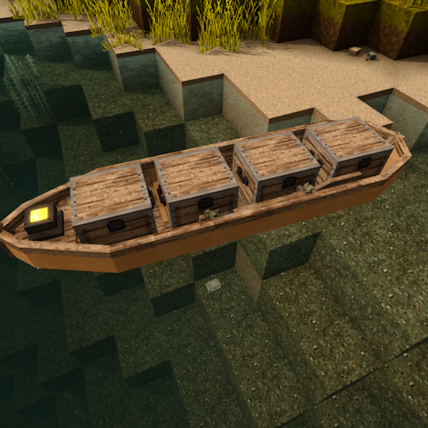
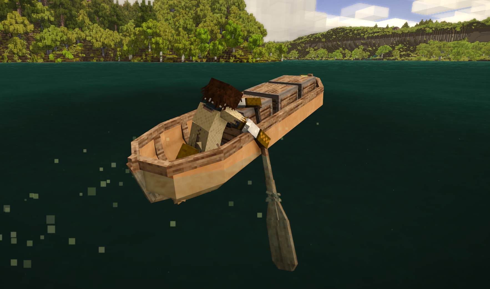

# Canoe Mod: Circuit's Patch

A Vintage Story mod that patches the "Canoe Mod" mod with a few personal tweaks.

## Description

This mod requires "Canoe Mod" and patches the barkcanoe.json to allow for more storage, control from any seat, and a speed increase.

### About "Canoe Mod" (Original Mod)

"Canoe Mod" allows the player to craft a birch bark canoe, that can carry up to 4 players, a light, and optional storage. 

## Features

- **Control from any seat**: You can now use the oar to control the canoe from any seat in the canoe.
- **More storage**: Every space in the canoe can now hold any chest, clay vessel, or basket.
- **Speed increase**: The canoe now goes 50% faster than the original.

## Screenshots

## Installation

1. Download the mod file
2. Place it in your Vintage Story `Mods` folder
3. Ensure you have the "Canoe Mod" mod installed (required dependency)
4. Launch Vintage Story

## Requirements

- **Vintage Story 1.20.12** (or compatible version)
- **Canoe Mod 1.0.2** (required dependency)

## Author

**CircuitPwne**

## Repository

[GitHub Repository](https://github.com/CircuitDev192/CanoeCircuitsPatch)

## Version

1.0.0

## License

GNU GPL v3
